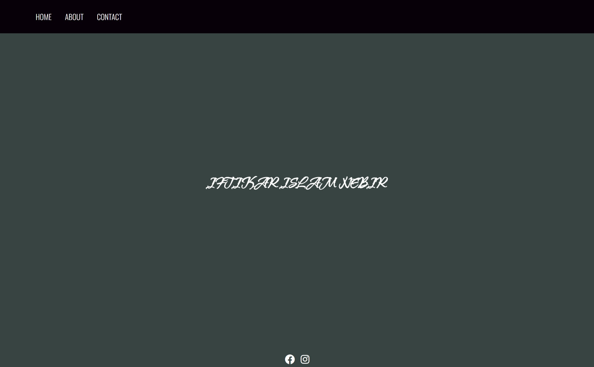

# i-nibir.github.io

<!-- Website home page screenshot  -->

A source code repo for the [i-nibir.github.io](https://i-nibir.github.io/) website. It's a portfolio website for Nibir

## Live View

The my works and version of the site is up in the given link below -

[Click Here](https://abir-tx.github.io/i-nibir.github.io/)
